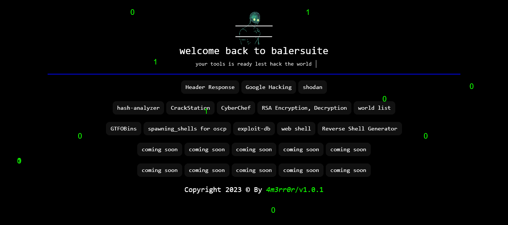

# Balersuite

BalerSuite is a web-based tool designed to help you level up your CTF and Bughunting skills. With its user-friendly interface and powerful functionality, BalerSuite is the ultimate tool for success in the competitive world of cybersecurity.

### Key Features

-  header response check
- google dork 
-  shodan search
-  wordlist 
- best web shell list
- User-friendly interface
- Powerful functionality for CTF and Bughunting
- Web-based for ease of use

Try It Now

Visit https://4m3rr0r0x0.000webhostapp.com/ to start using BalerSuite and elevate your skills in CTF and Bughunting.

   
  
   
   
</h1>
